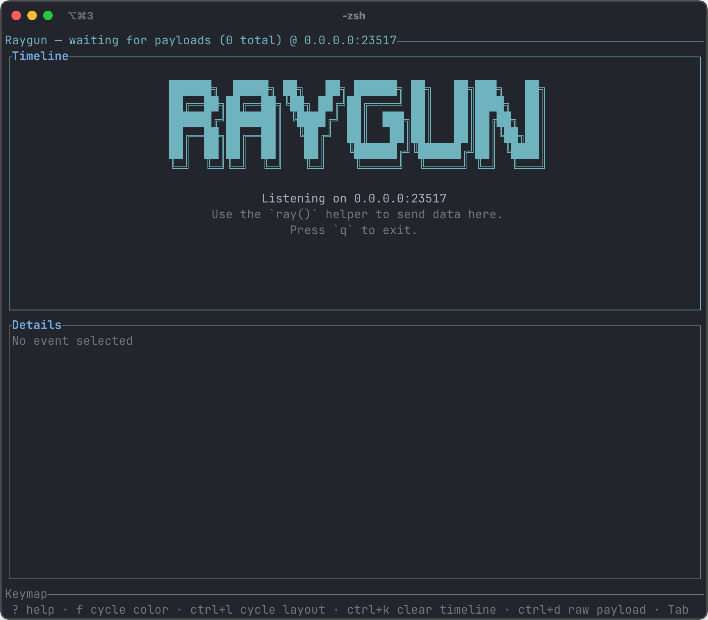
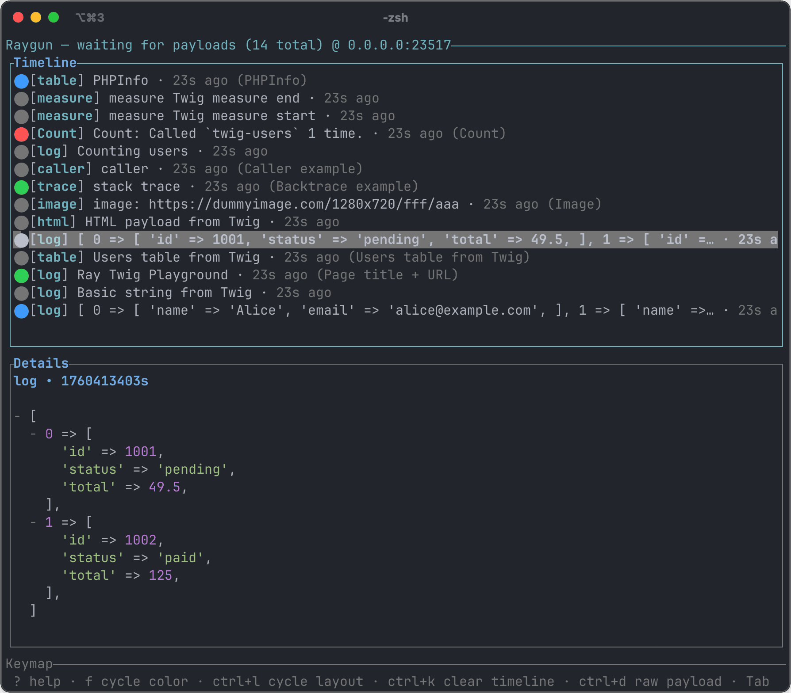

# Raygun (terminal Ray client)

Raygun is a terminal-based receiver for payloads sent with Spatie's amazing **Ray** debugger package for [PHP](https://myray.app/docs/php/vanilla-php/installation), [Grav](https://github.com/trilbymedia/grav-plugin-grav-ray), [Laravel](https://myray.app/docs/php/laravel/installation), and other ecosystems. It implements the same HTTP interface as the [Desktop Ray App](https://myray.app/), but renders payloads inside a fast rust-based TUI.





## Installation via Homebrew

Install the latest release on macOS or Linux via Homebrew (no manual tap
needed):

```bash
brew install yetidevworks/raygun/raygun
```

You can also download platform-specific archives from the
[Releases](https://github.com/yetidevworks/raygun/releases) page.

## Compiling via source

You can build and compile the app:

```bash
cargo run
```

While developing it is handy to persist every incoming request:

```bash
cargo run -- --debug-dump payloads.log
```

## Running the CLI

By default Raygun listens on `0.0.0.0:23517`. You can change the bind address
with `--bind <addr>` (or via `RAYGUN_BIND`). See `docs/running.md` for more CLI
options and keyboard shortcuts.

### Mouse support

Raygun listens for basic mouse events when your terminal forwards them (iTerm2, Kitty, WezTerm, etc.). Click timeline entries to select them, click inside the detail pane to move the cursor, and use the `+/-` glyph to expand or collapse nested values. Clicking anywhere inside the help or raw-payload overlays closes them. Most terminals require mouse reporting to be enabled; in iTerm2 this lives under **Profiles › Advanced › Mouse Reporting**.

## Supported payloads

Raygun understands the payload types produced by the official Ray SDKs. The
list below shows the formatting that is currently implemented:

| Category | Ray call (PHP examples) | Rendering in Raygun |
| --- | --- | --- |
| Basic logs | `ray('a message')` | Standard log entry with clipboard text |
| Colored / labelled | `ray($orders)->gray()->label('Orders')` | Timeline bubble uses the color; detail shows the structured data without the SfDump `<script>` noise |
| Multiple values | `ray($page->title, $request->url())` | Values rendered as a combined log payload |
| Tables | `ray()->table($users, 'Users')` | PHP array rendered as a formatted table |
| HTML | `ray()->html('<strong>HTML</strong>')` | Pretty-printed HTML tree |
| Images | `ray()->image('https://…/image.png')` | Timeline shows a clickable URL |
| Count | `ray('Counting users')->count('users')` | Timeline merges the log and count payload; detail shows the count message |
| Trace | `ray('Backtrace')->backtrace()` | Single `[trace]` entry with styled stack frames (class, method, file:line) |
| Caller | `ray('Caller')->caller()` | Single `[caller]` entry showing the originating frame |
| Exception | `ray()->exception($e)` | Dump specific exception in a readable format |
| Measure | `ray()->measure('DB query start'); ray()->measure('DB query end');` | Structured key/value summary (total time, delta, memory usage) |
| PHP info | `ray()->phpinfo()` | Key/value list highlighting version, ini paths, limits, and full extension list |
| JSON | `ray()->json(json_encode($data, JSON_PRETTY_PRINT))->label('JSON payload')` | Symfony SfDump wrappers are stripped; structured JSON tree rendered like native Ray |
| Images embedded in HTML | `ray('')` | Detected and rendered as a URL |

### Notes

- Timeline merging: count payloads and trace/caller payloads automatically pull
  the message from the preceding log entry so you only see a single combined
  entry in the list.
- Symfony’s SfDump HTML wrappers (emitted by `ray()->json()` and similar
  helpers) are stripped and rendered as structured JSON.
- When a payload includes `clipboard_data` it is preferred over the raw values,
  matching the desktop Ray behaviour.

If a payload type you use is not formatting nicely yet, capture it with
`--debug-dump` and open an issue (or Pull Request!) with the emitted payload so we can
add specialised rendering.

## License

Raygun is released under the [MIT License](LICENSE). Copyright © 2025 Andy Miller.
